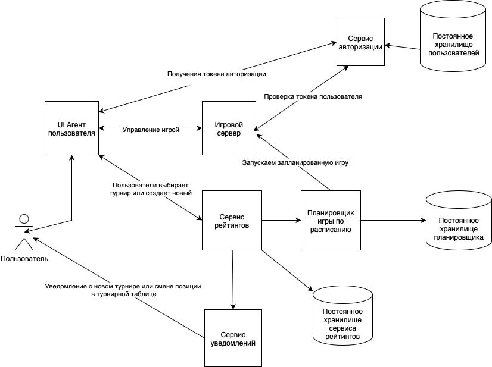

# Описание сервисов

1. UI Агент пользователя - Фронтэнд сервис для управления игрой, авторизиции и настройке.
2. Игровой сервер - выполняет запуск игр пользователей, содержит основную игровую логику.
3. Сервис авторизации - авторизует пользователя, выдает токен для выполнения взаимодействия и игровыми сервисами.
4. Сервис рейтингов - Содержит логику для формирования игровых рейтингов, турнирных таблиц, подбора противников.
5. Сервис уведомлений - Содержит логику для отправки уведомлений по почте, мессенджерам и тд.
6. Планировщик игры по расписанию - В заданное время запускает игру на сервере.
7. Постоянное хранилище сервиса рейтингов, Постоянное хранилище планировщика, Постоянное  хранилище  пользователей - БД где хранятся данные для сервисов.

# Типовой сценарий работы
1. Пользователе подключается через *агента*, получает токен авторизации.
2. При помощи *сервиса рейтингов* находит партнера по игре или создает свой турнир.
3. *Сервис рейтингов* планирует игру через *Планировщик игры по расписанию*
4. *Сервис рейтингов* отправляет уведомбении об игре через *Сервис уведомлений*
5. В заданное время игра начинается на *Игровом сервере*
6. После игры обновляются рейтинги игроков в турнирных таблицах.

# Возможные места расширения/изменения.
1. Игровые агенты могут быты реализованны на разных платформах: web, мобилиные, десктоп.
2. Сервис уведомлений может быть расширен на разные месенджеры и социальные сети.

# Узкие места проблемы
1. Вероятно самыым нагруженным будет игровой сервер, потребуется масштабирование на несколько экемпляров.
2. При масштабировании нужно учесть чтобы балансирощики нагрузки закрепляли игрока за одим сервером.
3. При больших нагрузка на возможно потребуется шардировать хранилища по регионам.
